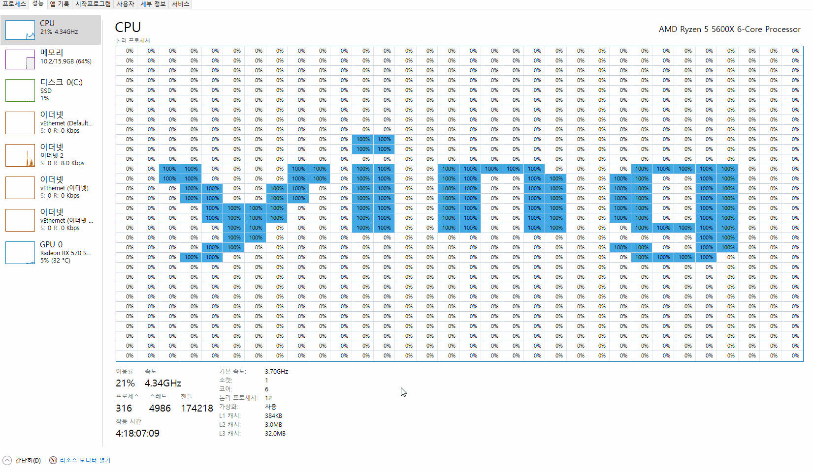

# Yingyeothon 25
주제 | 다수의 코어 활용
-----|-----
날짜 | 2021년 10월 30일
개발시간 | 오후 2시 ~ 오후5시

[사이트](https://yyt.life/2021/10/30/the-25.html)

# 모티브
유튜브를 보다가 우연히 발견한 영상.

윈도우 작업 관리자에서 둠을 돌리는 어마어마한 잉여력을 보고 감탄.

이게 어떻게 가능한 일인가. 나도 해보고 싶다!

# 접근
처음에는 빈루프를 돌리는 쓰레드를 특정 시간에 맞춰 생성하고 삭제하는 방식으로 해보려고 생각했다.

근데 이렇게 하면 896코어가 진짜 필요하다...

나는 AMD 라이젠 5600X 이어서 5코어 12쓰레드 밖에 되지 않는다.

그래서 내 작업 관리자는 논리 프로세서로 바꿔도 그래프로만 표시해준다.

그리하여, 처음 접근은 보류하고 내 작업 관리자를 어떻게 해킹할 수 있는지를 찾아봤다.

# 시행착오
토대가 되어준 고마운 오픈소스!
* https://github.com/turtiustrek/taskmanager

그렇지만 내 테스크 메니저의 버전이 호환되지 않았다.

결국에는 직접 exe 까서 pdb를 받고 메모리 바이트를 복사, 적용하니까 잘 되었음.

아래는 도움이 된 영상들!

* https://www.youtube.com/watch?v=oKQ1X_4JCn0
* https://www.youtube.com/watch?v=3M4Y83-7IMA

# 결과물

고작 6코어 12쓰레드에서 1024개의 CPU를 시뮬레이션 할 수 있고 멋진 잉여톤은 사랑입니다를 출력할 수 있다.

당연히 코어가 더 많을 수록 해상도는 높아지니 멋진 결과를 기대할 수 있다.